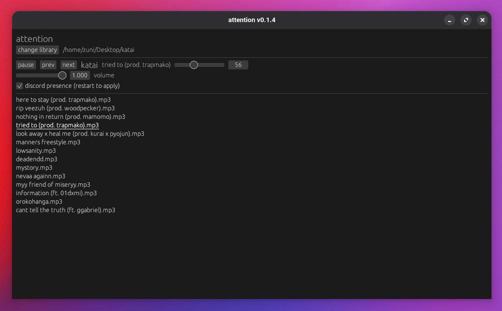

# attention
minimal graphical music player

# known issues
- some applications might refuse from working and complain about attention claiming audio streams exclusively for itself

# features
- select a library of audio files
- automatically play next song or skip manually
- adjust the volume
- start over when the queue is done
- pause and resume playback
- skip and rewind the audio track
- display title and artist tags

# planned
- discord rich presence integration that displays the title and artist name (contributions welcome)

# build instructions
- have cargo and rustc installed
- run `cargo build --release`
